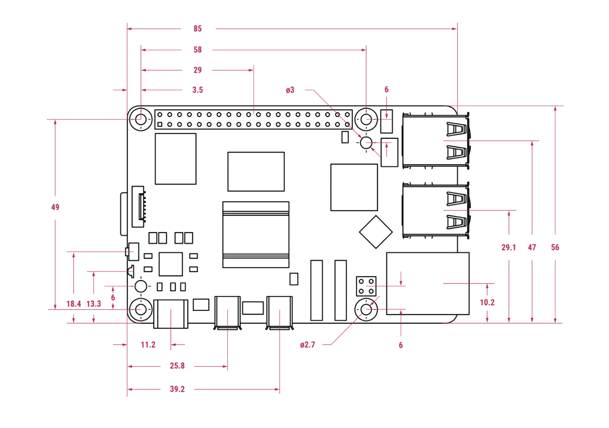

# Image & Video Processing on Embedded Systems (Raspberry Pi)

<p align="center">
  
</p>

<p align="center">
  <b>Real-time image + video processing labs on Raspberry Pi</b><br/>
  Computer vision fundamentals → panorama stitching → Haar detection → background replacement
</p>

<p align="center">
  <a href="#labs">Labs</a> •
  <a href="#tech-stack">Tech Stack</a> •
  <a href="#setup">Setup</a> •
  <a href="#results--demos">Results</a> •
  <a href="#performance-notes">Performance</a>
</p>

<p align="center">
  
  
  
  
</p>

---

## Why this repo matters (for embedded / Raspberry Pi engineering)

This project is a hands-on embedded vision portfolio demonstrating:

- **Camera I/O + frame processing loops**
- **Classic image processing** (histograms, filtering, equalization)
- **Feature extraction** (edges, Harris corners) and **panorama stitching**
- **Object detection** using **Haar cascades**
- **Foreground segmentation + compositing** for background replacement
- **Performance awareness** on constrained hardware (CPU/RAM, timing instrumentation)

> If you’re hiring for embedded, robotics, or CV roles: this repo shows **end-to-end pipelines**, not just isolated algorithms.

---

## Architecture (embedded vision pipeline)

```mermaid
flowchart LR
  CAM[Camera / Video Input] --> PRE[Preprocess\n(resize, gray, denoise)]
  PRE --> FEAT[Features\n(edges, corners)]
  PRE --> DET[Detection\n(Haar cascade)]
  DET --> SEG[Segmentation\n(GrabCut-like)]
  FEAT --> STITCH[Stitching\n(homography warp)]
  SEG --> COMP[Compositing\n(alpha + paste)]
  STITCH --> OUT[Output\nimage/video]
  COMP --> OUT 
